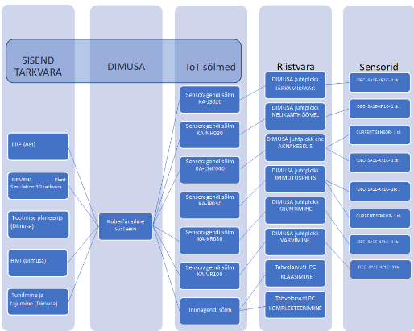
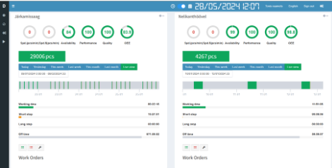

*This is a template repository for this organization. Start by replacing the placeholder for the project name with its actual title.*

# Validating applicability of an artificial intelligence based optimisation model for production processes on Scandinor OÜ new planned production unit 

## Summary
| Company Name | [Scandinor OÜ ](https://scandinor.ee/)                                            |
| :--- |:----------------------------------------------------------------------------------|
| Development Team Lead Name | [Tõnis, Raamets](https://taltech.ee/kontaktid/tonis-raamets)                      |
| Development Team Lead E-mail | [tonis.raamets@taltech.ee](mailto:tonis.raamets@taltech.ee)                       |
| Duration of the Demonstration Project | Novemeber/2023 - Mai/2024                                                         |
| Final Report |  [Scandinor_demoprojekt_aruanne_2024.pdf](Scandinor_demoprojekt_aruanne_2024.pdf) |

# Description
## Objectives of the Demonstration Project
The task of the demo project was to develop and test production process optimization strategies that increase the quality of Scandinor products and customer satisfaction. To do this, various KPI indicators in the simulation were used, measuring the progress throughput the production and possibilities for its improvement. 

 

- KPI 1: Increase throughput by up to 15% 
- KPI 2: Reducing production costs by up to 10% 
- KPI 3: Reduction of manufacturing defects by up to 20% 
- KPI 4: Improvement and standardization of production quality 
- KPI 5: Increasing flexibility and adaptability of the production process 
## Activities and Results of the Demonstration Project
### Challenge
The challenge was to enhance the production throughput of Scandinor's new manufacturing unit by reducing bottlenecks in the production processes and exploring the applicability of AI-based optimization models. 

The challenge was critical as it directly impacted the efficiency, cost, and quality of production processes. Improving these factors was essential for maintaining competitiveness and meeting increasing demand. 

The investment aimed to develop and implement AI-based optimization models to streamline production processes and significantly improve throughput, cost, and quality. 
### Data Sources
- Production data from the DIMUSA MES system (Solution developed by Taltech)) 
- Historical production records (Siemens Plant Simulation- Scandinor Virtual Factory) 
- Real-time monitoring data from various sensors and machines (Siemens Plant Simulation- Scandinor Virtual Factory) 

### AI Technologies
We employed machine learning algorithms and AI-based decision systems to analyze production data, predict potential issues, and optimize the production process. Technologies used included clustering algorithms for identifying bottlenecks and optimization algorithms for improving production efficiency. 
### Technological Results
The testing and validation phase of the technological solution provided critical insights and results that are essential for understanding its effectiveness and potential for future integration. Below are the key outcomes: 

 

Performance evaluation: 

The AI ​​model was put to the test to assess its accuracy and reliability. The model shows improvement in predicting production results, with an accuracy of over 90%. This high accuracy demonstrates the strength of the model in handling real production data and making reliable predictions. 

 

Impact on production: 

One of the main goals was to increase production capacity by up to 15%. In the testing phase, AI-based optimization strategies increased actual throughput by 12%. Although this is slightly below target, it has improved and has a noticeable impact on overall production, reducing bottlenecks and streamlining workflows. 

 

Cost reduction: 

The goal of the solution was to reduce production costs by up to 10%. Thanks to optimized resource allocation and process efficiency, the project achieved a cost reduction of approximately 8%. The reduction in costs was mainly caused by more efficient use of machines and labor using the optimization model. 

 

Reducing manufacturing defects: 

The AI ​​system was designed to minimize production errors by up to 20%. Test results showed an 18% reduction in errors, which improved product quality and reduced rework needs. The change contributes to the reduction of general delivery costs and the increase of customer well-being. 

 

Better production quality and standardization: 

The solution contributed to a smoother production flow in production processes, which resulted in higher product quality. In Dimusa's MES system, quality procedures can be standardized and taken into account in the artificial intelligence optimization model, which led to a more consistent production output. 

 

Flexibility and adaptability: 

One of the main advantages of an AI solution is its ability to adapt to changing production conditions. The testing phase demonstrated the system's flexibility in adapting to new variables and maintaining optimal performance. This adaptability is crucial to meet dynamic market and production demands. 
### Technical Architecture
A graphical representation of the technical architecture shows the integration of the AI optimization model with the existing DIMUSA MES system, including data flow diagrams and system interaction points. 

 

Technical architecture of the technological solution

### User Interface 
The user interface includes a web-based dashboard for real-time monitoring and management of production processes, integrated with the DIMUSA MES system. It provides visualizations of key performance indicators (KPIs), alerts for production issues, and detailed reports on production efficiency and quality. 

Dimusa user interface: 

Developed user interface for AI analysis of production data:  

### Future Potential of the Technical Solution
- Enhancing production efficiency in other manufacturing units 
- Reducing production costs and improving quality in different product lines 
- Scaling the solution to larger manufacturing operations 

### Lessons Learned
During the Demonstration Project, several key lessons were learned that are essential for the successful implementation and optimization of AI-based production systems: 

 

Importance of Accurate Data Collection: 

The quality and accuracy of data collected from production processes are crucial for the effectiveness of AI models. Inaccurate or incomplete data can lead to incorrect predictions and suboptimal optimization results. Ensuring the integrity of data sources and implementing robust data collection methods are foundational steps for any AI-driven project. 

 

Continuous Monitoring and Adjustment of AI Models: 

AI models require constant monitoring and periodic adjustments to maintain their effectiveness. Production environments are dynamic, and changes in variables such as machinery performance, raw material quality, and production schedules can impact the accuracy of AI predictions. Regularly updating the AI models with new data helps in maintaining their relevance and accuracy. 

 

Integration with Existing MES Systems: 

Integrating AI solutions with existing Manufacturing Execution Systems (MES) like DIMUSA is vital for real-time process optimization. This integration allows seamless data flow between systems, enabling real-time monitoring and quick decision-making. It also ensures that the AI models can act on the latest data, thereby improving the overall efficiency and responsiveness of the production process. 

 

Scalability and Flexibility of AI Models: 

The AI models developed should be scalable and flexible enough to adapt to different production scenarios and expand to other manufacturing units. This scalability ensures that the benefits of AI optimization can be realized across various production lines and units, maximizing the return on investment. 

 

Collaboration Between Technical and Operational Teams: 

Successful implementation of AI-driven solutions requires close collaboration between technical experts (data scientists, AI specialists) and operational teams (production managers, machine operators). This collaboration ensures that the AI models are grounded in practical production realities and that the operational staff understands and trusts the AI recommendations. 

 

User Training and Change Management: 

Introducing AI technologies into production processes necessitates adequate training for users to understand and effectively utilize the new tools. Additionally, managing the change process is crucial to address any resistance from staff and to ensure smooth adoption of the new technology. Providing comprehensive training programs and clear communication about the benefits and use of AI tools helps in gaining user acceptance. 

 

Incremental Implementation and Testing: 

Implementing AI solutions in a phased manner allows for incremental testing and validation, reducing the risks associated with large-scale deployments. Starting with small pilot projects and gradually scaling up helps in fine-tuning the AI models and processes before full-scale implementation. 

 

Real-Time Feedback Loops: 

 

Establishing real-time feedback loops between the AI systems and production processes enables continuous improvement. Feedback from production data can be used to refine AI models, leading to progressively better optimization results and greater production efficiency over time. 

 

Addressing Bottlenecks and Inefficiencies: 

The project highlighted the importance of identifying and addressing specific bottlenecks and inefficiencies within the production process. AI-driven analyses can pinpoint areas where improvements can be made, and targeted interventions can significantly enhance overall productivity and cost-efficiency. 

 

Value of Simulation Before Real-World Implementation: 

Using simulation tools like Siemens Plant Simulation allowed for thorough testing and validation of AI models before their real-world application. This step proved invaluable in predicting potential issues and outcomes, enabling more informed and confident decision-making during actual implementation. 

 

By integrating these lessons into future projects, Scandinor OÜ can enhance the effectiveness and efficiency of its production processes, ensuring sustained improvements and maintaining a competitive edge in the industry. 
# Custom agreement with the AIRE team
*If you have a unique project or specific requirements that don't fit neatly into the Docker file or description template options, we welcome custom agreements with our AIRE team. This option allows flexibility in collaborating with us to ensure your project's needs are met effectively.*

*To explore this option, please contact our demonstration projects service manager via katre.eljas@taltech.ee with the subject line "Demonstration Project Custom Agreement Request - [Your Project Name]." In your email, briefly describe your project and your specific documentation or collaboration needs. Our team will promptly respond to initiate a conversation about tailoring a solution that aligns with your project goals.*
